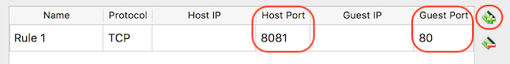

# Access VM via Localhost

Setting up portforwarding that enables users to access Localhost

## Getting Started

Simple setting, creating home directory in index page

### Installation

1. Go to VirtualBox Manager,
	- Settings > Network > Adapter 1:\
		- Open Advanced, click Portforwarding\
	
	
		- \+ button on the right\
		- Host Port: 8080 | Guest Port: 80\
	

> You can make your own Host Port but Guest Port must be 80\
> Yeah, mine is 8081 because I have two VM OS :)

2. Power up Debian, run following command on your Debian:
```
cd /var/www/html
sudo ln -s ~ home
```

> You can set the name of dir instead of 'home'

## Usage

Open an internet browser, go to [localhost:8080](http://localhost:8080)\


## Author

* **Mingyun Kim** - [mikim42](https://github.com/mikim42)

## Others

* **[HOME](https://github.com/mikim42/ohlone_cs_util)**
* **[SSH_setup](../ssh_setup)**
